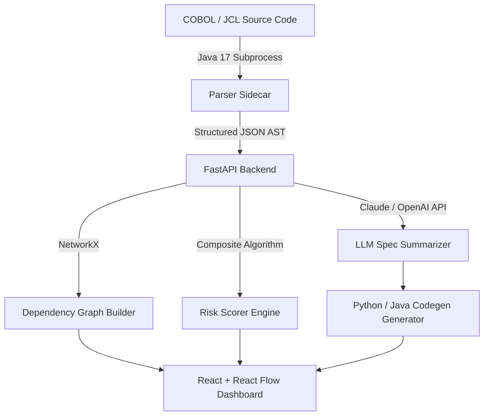

# Monolith Architecture Specification

## Overview

Monolith is a polyglot legacy intelligence and modernization engine designed to parse, analyze, score, and migrate COBOL/JCL mainframe systems into modern cloud-native microservices (Python 3.12 or Java Spring Boot).

## End-to-End System Pipeline

## Core Service Architecture

### 1. Parser Sidecar (`parser-sidecar/`)
- Built on Java 17, Maven 3.9, ANTLR4, Jackson JSON, and Apache Commons IO.
- Extracts Procedure Division paragraphs, statement counts, and McCabe cyclomatic complexity scores.
- Parses 01, 05, 77, and 88 level data division memory structures and REDEFINES clauses.
- Captures static/dynamic program CALL targets, copybook dependencies, SELECT/ASSIGN VSAM file declarations, and EXEC SQL / EXEC CICS blocks.

### 2. Backend Orchestration (`backend/`)
- Powered by FastAPI and Python 3.12.
- Builds a directed graph $G = (V, E)$ using NetworkX where $V$ represents programs, copybooks, files, and JCL jobs, and $E$ represents CALL, COPY, ACCESS, and EXECUTE relationships.
- Scores risk using a weighted composite model:
  $$ \text{Risk Score} = 0.35 C + 0.30 B + 0.20 S + 0.15 L $$
  where $C$ is cyclomatic complexity, $B$ is blast radius (in-degree + out-degree), $S$ is SQL/CICS penalty, and $L$ is lines of code.

### 3. LLM Business Spec Engine (`backend/app/services/llm_summarizer.py`)
- Invokes Anthropic (`claude-3-5-sonnet-20241022`) or OpenAI (`gpt-4o-mini`) APIs with structural AST hints.
- Enforces strict Pydantic JSON outputs: `{summary, businessRules, inputs, outputs, edgeCases, migrationNotes}`.
- Includes a deterministic offline fallback engine for zero-key local demonstration environments.

### 4. Modern Codegen Engine (`backend/app/services/codegen.py`)
- Automatically transforms LLM business specs into modern target codebases.
- Supports dual target stacks:
  - Python 3.12 typed service stub + pytest suite skeleton.
  - Java 17 Spring Boot `@Service` class + SpringBootTest skeleton.

### 5. React Dashboard (`frontend/`)
- Visualizes the dependency graph using React Flow with custom color-coded nodes.
- Provides a sortable Risk Heatmap table ranking codebase programs by blast radius and complexity.
- Renders a side-by-side split view showing raw COBOL source code next to the extracted business spec.
- Exports executive PDF/JSON audit reports detailing total LOC, estimated developer person-days, and risk bucket distribution.
